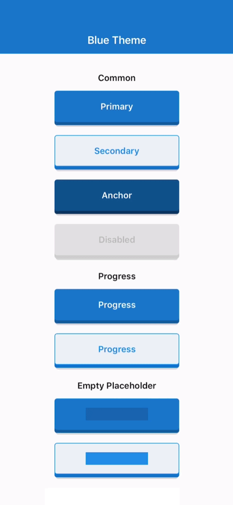
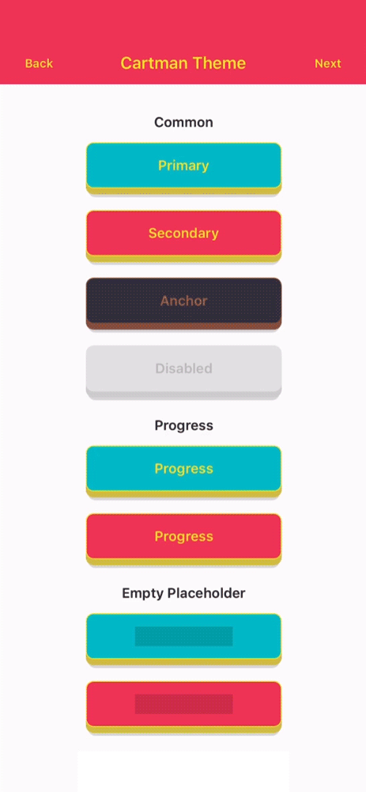
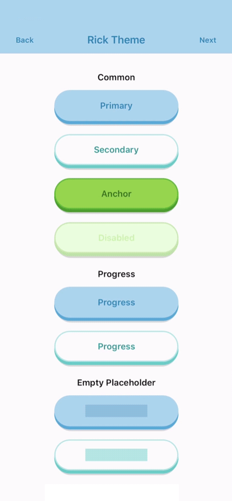

# Swift Awesome Button

`SwiftAwesomeButton` is the SwiftUI package for expressive 3D-style buttons,
themed variants, progress states, text transitions, auto-width sizing, and
placeholder loading states.

The library exports:

- `AwesomeButton`
- `ThemedButton`
- `getTheme`
- UIKit wrappers: `AwesomeButtonControl` and `ThemedButtonControl`
- typed Swift models such as `AwesomeButtonStyle`, `AwesomeButtonThemeData`,
  `ThemeName`, `ButtonVariant`, `ButtonSize`, `ThemeButtonStyle`,
  `ThemeSizeStyle`, `ThemeDefinition`, and `RegisteredThemeDefinition`

https://github.com/user-attachments/assets/a843570d-1e97-4858-8fb3-3a1a0777b6ea

## Install

Add the package in Xcode through **File > Add Package Dependencies...**:

```text
https://github.com/rcaferati/swift-awesome-button.git
```

Then add the `SwiftAwesomeButton` product to your iOS app target.

Current Swift support:

- Swift 5.10
- iOS 16.0+
- SwiftUI

## Basic Usage

```swift
import SwiftAwesomeButton
import SwiftUI

struct SaveButton: View {
    var body: some View {
        AwesomeButton(
            child: "Save",
            onPress: { _ in
                print("Pressed")
            }
        )
    }
}
```

`AwesomeButton` supports both plain string labels and arbitrary SwiftUI labels.

```swift
AwesomeButton(
    onPress: { _ in
        print("Pressed")
    }
) {
    Label("Continue", systemImage: "arrow.right")
}
```

<table>
  <tr>
    <td width="33%">
      
    </td>
    <td width="33%">
      
    </td>
    <td width="33%">
      
    </td>
  </tr>
</table>

## Size Changes

`animateSize` is enabled by default.

- fixed `width` / `height` changes animate with the package size animation
- `ThemedButton` size preset changes animate because they resolve to fixed
  width and height updates
- auto-width string labels grow and shrink when their measured target width
  changes
- with `textTransition` plus auto width, wider labels animate text while
  growing and narrower labels start text first, then shrink width after the
  text transition begins
- `animateSize: false` keeps size changes instant
- fixed-to-auto and auto-to-fixed changes remain instant

Swift keeps auto-width target measurement inside the package renderer. The
hidden measurement path is internal and does not intercept input.

```swift
import SwiftAwesomeButton
import SwiftUI

struct SizeExample: View {
    let isLong: Bool

    var body: some View {
        let label = isLong ? "Open analytics dashboard" : "Open"

        VStack(spacing: 12) {
            ThemedButton(
                child: label,
                name: .basic,
                autoWidth: true,
                textTransition: true
            )

            ThemedButton(
                child: label,
                name: .basic,
                autoWidth: true,
                animateSize: false
            )
        }
    }
}
```

## Progress Buttons

When `progress` is enabled, `onPress` receives an
`AwesomeButtonProgressHandle?`. Call it when your work is done to complete the
progress animation and release the button.

```swift
import SwiftAwesomeButton
import SwiftUI

struct SubmitButton: View {
    var body: some View {
        AwesomeButton(
            child: "Submit",
            progress: true,
            onPress: { next in
                DispatchQueue.main.asyncAfter(deadline: .now() + 0.8) {
                    next?()
                }
            }
        )
    }
}
```

Progress uses the typed completion contract:

```swift
public typealias AwesomeButtonPressCallback = (AwesomeButtonProgressHandle?) -> Void

public final class AwesomeButtonProgressHandle {
    public func callAsFunction(_ callback: (() -> Void)? = nil)
}
```

## Themed Buttons

```swift
import SwiftAwesomeButton
import SwiftUI

struct ThemeExample: View {
    var body: some View {
        VStack(spacing: 12) {
            ThemedButton(
                child: "Rick Primary",
                name: .rick,
                type: .primary
            )

            ThemedButton(
                child: "Rick Secondary",
                name: .rick,
                type: .secondary
            )
        }
    }
}
```

If you need the full registered theme object, use `getTheme`.

```swift
import SwiftAwesomeButton
import SwiftUI

struct ThemeConfigExample: View {
    var body: some View {
        let theme = getTheme(index: 0)

        ThemedButton(
            child: theme.title,
            config: theme,
            type: .anchor
        )
    }
}
```

`getTheme()` safely falls back to the default `basic` theme if the provided
index or name is invalid.

## Before / After / Extra Content

Use `before` and `after` for inline content rendered inside the button face,
and `extra` for content rendered behind the active/content layers.

```swift
import SwiftAwesomeButton
import SwiftUI

struct ButtonContentExample: View {
    var body: some View {
        AwesomeButton(
            before: AnyView(Image(systemName: "arrow.left").foregroundStyle(.white)),
            after: AnyView(Image(systemName: "arrow.right").foregroundStyle(.white)),
            extra: AnyView(
                LinearGradient(
                    colors: [
                        Color(red: 0.30, green: 0.39, blue: 0.82),
                        Color(red: 0.74, green: 0.19, blue: 0.51),
                        Color(red: 0.96, green: 0.44, blue: 0.20),
                        Color(red: 1.00, green: 0.84, blue: 0.46),
                    ],
                    startPoint: .topLeading,
                    endPoint: .bottomTrailing
                )
            ),
            style: AwesomeButtonStyle(
                foregroundColor: .white
            )
        ) {
            Text("Continue")
                .fontWeight(.bold)
                .foregroundStyle(.white)
        }
    }
}
```

## Transparent Buttons

`transparent` is supported on `ThemedButton`. It removes the visible shell
layers while preserving the content, hit target, and active/progress feedback.

```swift
import SwiftAwesomeButton
import SwiftUI

struct TransparentExample: View {
    var body: some View {
        ThemedButton(
            child: "Transparent",
            name: .bruce,
            type: .anchor,
            transparent: true
        )
    }
}
```

## Built-in Theme Contract

### Theme Names

- `basic`
- `bojack`
- `cartman`
- `mysterion`
- `c137`
- `rick`
- `summer`
- `bruce`

### Variants

- `primary`
- `secondary`
- `anchor`
- `danger`
- `disabled`
- `flat`
- `x`
- `messenger`
- `facebook`
- `github`
- `linkedin`
- `whatsapp`
- `reddit`
- `pinterest`
- `youtube`

### Sizes

- `icon`
- `small`
- `medium`
- `large`

## Selected Parameters

The public surface is typed through `AwesomeButton`, `ThemedButton`, and their
UIKit wrappers.

### AwesomeButton

| Parameter | Type | Default | Description |
| --- | --- | --- | --- |
| `child` | `String?` | `nil` | Plain string label. String labels support `textTransition`. |
| `onPress` | `AwesomeButtonPressCallback?` | `nil` | Main press callback. In progress mode it receives the completion handle. |
| `onLongPress` | `(() -> Void)?` | `nil` | Optional long-press callback. |
| `disabled` | `Bool` | `false` | Disables interactions. |
| `width` | `CGFloat?` | `nil` | Fixed width, or leave nil for auto width. Pair with `stretch` for full width. |
| `height` | `CGFloat` | `52` | Face height before the raise layer is added. |
| `paddingHorizontal` | `CGFloat?` | `16` resolved | Horizontal content padding. |
| `before` | `AnyView?` | `nil` | Content rendered before the main label inside the button face. |
| `after` | `AnyView?` | `nil` | Content rendered after the main label inside the button face. |
| `extra` | `AnyView?` | `nil` | Content rendered behind the active/content layers. |
| `stretch` | `Bool` | `false` | Makes the button fill the available horizontal space. |
| `style` | `AwesomeButtonStyle?` | `nil` | Visual override surface for colors, border, raise, animation, and typography. |
| `activeOpacity` | `Double` | `1` | Opacity applied while the non-progress button is pressed. |
| `debouncedPressTime` | `TimeInterval` | `0` | Debounces `onPress` dispatch. |
| `progress` | `Bool` | `false` | Enables the progress-button flow. |
| `showProgressBar` | `Bool` | `true` | Shows or hides the loading bar during progress. |
| `progressLoadingTime` | `TimeInterval` | `3` | Duration of the loading bar travel in progress mode. |
| `animateSize` | `Bool` | `true` | Animates fixed-size geometry changes and auto-width string-label changes. |
| `textTransition` | `Bool` | `false` | Enables the built-in scramble/reveal animation when a plain string label changes. |
| `animatedPlaceholder` | `Bool` | `true` | Enables the shimmer loop when the button has no child. |
| `hapticOnPress` | `Bool` | `true` | Enables iOS haptic feedback on press. |

### ThemedButton Additional Parameters

| Parameter | Type | Default | Description |
| --- | --- | --- | --- |
| `config` | `ThemeDefinition?` | `nil` | Explicit theme object. When provided, it takes precedence over `name` and `index`. |
| `index` | `Int?` | `nil` | Theme index used by `getTheme(index:)` when `config` and `name` are not provided. |
| `name` | `ThemeName?` | `nil` | Named built-in theme selector. |
| `type` | `ButtonVariant` | `.primary` | Built-in variant to resolve from the selected theme. |
| `size` | `ButtonSize` | `.medium` | Built-in theme size preset. |
| `flat` | `Bool` | `false` | Requests the `flat` theme variant when available. |
| `transparent` | `Bool` | `false` | Makes the visible shell layers transparent while keeping content, press, and progress feedback active. |
| `autoWidth` | `Bool` | `false` | Requests measured auto width instead of the size preset width. |

## Development

Primary package quality gate:

```bash
xcodebuild -scheme swift-awesome-button -destination 'platform=iOS Simulator,name=iPhone 17 Pro' test
```

To validate the demo app:

```bash
xcodebuild -project Examples/IOSAwesomeButtonDemoApp/IOSAwesomeButtonDemoApp.xcodeproj -scheme IOSAwesomeButtonDemoApp -destination 'generic/platform=iOS Simulator' build
```

Plain `swift test` is not the supported validation command for this repository.
The package is intentionally iOS-only, and that command attempts to compile the
SwiftUI target for macOS. Use the iOS Simulator `xcodebuild` test command above
for release validation.

## Example App

The manual acceptance app lives in
[Examples/IOSAwesomeButtonDemoApp](Examples/IOSAwesomeButtonDemoApp).

The app includes:

- `Themed` tab with nested theme navigation and the full themed showcase
- `Progress` tab with dedicated progress-button demos
- `Social` tab with social-button demos
- `Size Changes` tab for text and geometry transition demos

Open it in Xcode from the repository root:

```bash
open Examples/IOSAwesomeButtonDemoApp/IOSAwesomeButtonDemoApp.xcodeproj
```

Build it from the repository root:

```bash
xcodebuild -project Examples/IOSAwesomeButtonDemoApp/IOSAwesomeButtonDemoApp.xcodeproj -scheme IOSAwesomeButtonDemoApp -destination 'generic/platform=iOS Simulator' build
```

## Author

**Rafael Caferati**  
Website: https://caferati.dev  
LinkedIn: https://linkedin.com/in/rcaferati  
Instagram: https://instagram.com/rcaferati

## License

MIT. See [LICENSE](LICENSE). Third-party asset notices are listed in
[NOTICE.md](NOTICE.md).
