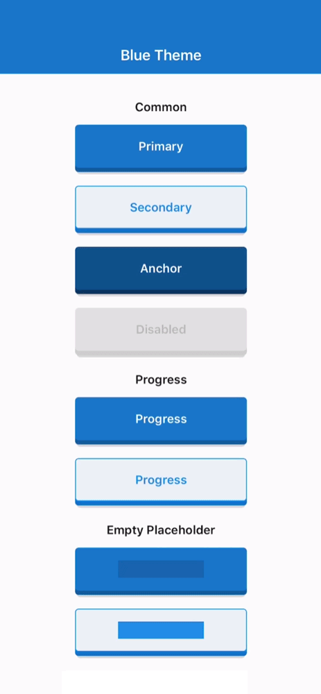
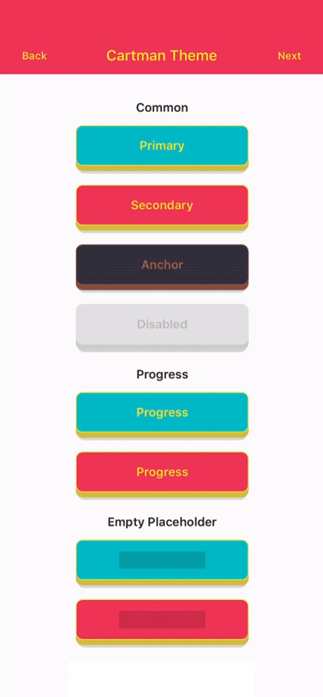
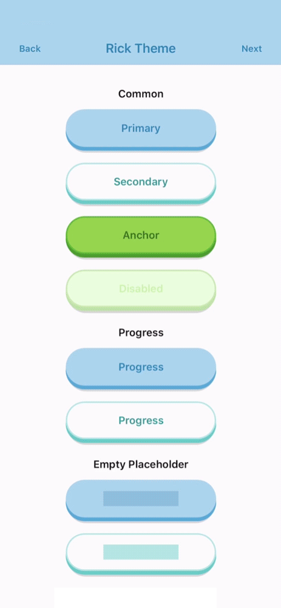

# Swift Awesome Button

`SwiftAwesomeButton` is a Swift package that brings the Awesome Button
interaction, progress, sizing, and theme system to iOS through SwiftUI views
and programmatic UIKit controls with shared native lifecycle and accessibility
behavior.

The library exports:

- `AwesomeButton`
- `ThemedButton`
- `getTheme`
- UIKit controls: `AwesomeButtonControl` and `ThemedButtonControl`
- typed Swift models such as `AwesomeButtonStyle`, `AwesomeButtonThemeData`,
  `ThemeName`, `ButtonVariant`, `ButtonSize`, `ThemeButtonStyle`,
  `ThemeSizeStyle`, `ThemeDefinition`, and `RegisteredThemeDefinition`

The video below demonstrates the package's press, progress, theme, and size
transitions.

<video autoplay muted loop playsinline style="width:100%;max-height:640px" src="https://github.com/user-attachments/assets/a843570d-1e97-4858-8fb3-3a1a0777b6ea"></video>
[Open video directly](https://github.com/user-attachments/assets/a843570d-1e97-4858-8fb3-3a1a0777b6ea)

<table>
  <tr>
    <td width="33%">
      
    </td>
    <td width="33%">
      
    </td>
    <td width="33%">
      
    </td>
  </tr>
</table>

## Figma File

Explore the shared Awesome Button visual system in the [Figma design file](https://www.figma.com/file/Ug8sNPzmevU3ZQus9Klu5aHq/react-awesome-button-theme-blue). The Figma file is a visual design reference; this package's documentation defines its behavior, accessibility, and public API contract.

## Installation

Add the package in Xcode through **File > Add Package Dependencies...**:

```text
https://github.com/rcaferati/swift-awesome-button.git
```

Then add the `SwiftAwesomeButton` product to your iOS app target.

For a manifest-based integration:

```swift
dependencies: [
    .package(
        url: "https://github.com/rcaferati/swift-awesome-button.git",
        from: "1.0.0"
    ),
]
```

Add the library product to the consuming target:

```swift
.target(
    name: "YourApp",
    dependencies: [
        .product(
            name: "SwiftAwesomeButton",
            package: "swift-awesome-button"
        ),
    ]
)
```

Current Swift support:

- Swift 5.10
- iOS 16.0+
- SwiftUI and programmatic UIKit controls

The UIKit controls are a supported public package surface; UIKit is not treated
as a deprecated compatibility shim. See the package's DocC catalog for direct,
themed, progress, accessibility, Reduced Motion, UIKit, and Apple-only haptic
guidance.

## Basic Usage

```swift
import SwiftAwesomeButton
import SwiftUI

struct SaveButton: View {
    var body: some View {
        AwesomeButton(
            child: "Save",
            onPress: { _ in
                print("Pressed")
            }
        )
    }
}
```

`AwesomeButton` supports both plain string labels and arbitrary SwiftUI labels.

```swift
AwesomeButton(
    onPress: { _ in
        print("Pressed")
    }
) {
    Label("Continue", systemImage: "arrow.right")
}
```

## Features

### Size Changes

`animateSize` is enabled by default.

- fixed `width` / `height` changes animate with the package size animation
- `ThemedButton` size preset changes animate because they resolve to fixed
  width and height updates
- auto-width string labels grow and shrink when their measured target width
  changes
- with `textTransition` plus auto width, wider labels animate text while
  growing and narrower labels start text first, then shrink width after the
  text transition begins
- transient scramble frames never retarget auto width; the accepted source and
  target measurements remain the size-animation endpoints
- resolved font size and line height follow the same explicit style progress;
  package-owned string labels add a restrained `1.00 → 1.04 → 1.00` scale bump
  when the effective font size changes
- `animateSize: false` keeps size changes instant
- fixed-to-auto and auto-to-fixed changes remain instant

Swift resolves plain-string auto width from the accepted target label so
temporary text-transition frames cannot feed back into size animation. Custom
content and auxiliary-slot rows use the single rendered row measurement.
`before`, the label, `after`, padding, and border participate in that width; the
face-overlay `extra` slot does not. Generic labels and placeholders use the face
height as their initial and minimum auto width.

```swift
import SwiftAwesomeButton
import SwiftUI

struct SizeExample: View {
    let isLong: Bool

    var body: some View {
        let label = isLong ? "Open analytics dashboard" : "Open"

        VStack(spacing: 12) {
            ThemedButton(
                child: label,
                name: .basic,
                autoWidth: true,
                textTransition: true
            )

            ThemedButton(
                child: label,
                name: .basic,
                autoWidth: true,
                animateSize: false
            )
        }
    }
}
```

### Progress Buttons

When `progress` is enabled, `onPress` receives an
`AwesomeButtonProgressHandle?`. Call it when your work is done to complete the
progress animation and release the button.

```swift
import SwiftAwesomeButton
import SwiftUI

struct SubmitButton: View {
    var body: some View {
        AwesomeButton(
            child: "Submit",
            progress: true,
            onPress: { next in
                DispatchQueue.main.asyncAfter(deadline: .now() + 0.8) {
                    next?()
                }
            }
        )
    }
}
```

Progress uses the typed completion contract:

```swift
public typealias AwesomeButtonPressCallback = (AwesomeButtonProgressHandle?) -> Void

public final class AwesomeButtonProgressHandle {
    public func callAsFunction(_ callback: (() -> Void)? = nil)
}
```

### Themed Buttons

```swift
import SwiftAwesomeButton
import SwiftUI

struct ThemeExample: View {
    var body: some View {
        VStack(spacing: 12) {
            ThemedButton(
                child: "Rick Primary",
                name: .rick,
                type: .primary
            )

            ThemedButton(
                child: "Rick Secondary",
                name: .rick,
                type: .secondary
            )
        }
    }
}
```

If you need the full registered theme object, use `getTheme`.

```swift
import SwiftAwesomeButton
import SwiftUI

struct ThemeConfigExample: View {
    var body: some View {
        let theme = getTheme(index: 0)

        ThemedButton(
            child: theme.title,
            config: theme,
            type: .anchor
        )
    }
}
```

`getTheme()` safely falls back to the default `basic` theme if the provided
index or name is invalid.

### Before / After / Extra Content

Use `before` and `after` for inline content rendered inside the button face,
and `extra` for content rendered behind the active/content layers.

```swift
import SwiftAwesomeButton
import SwiftUI

struct ButtonContentExample: View {
    var body: some View {
        AwesomeButton(
            before: AnyView(Image(systemName: "arrow.left").foregroundStyle(.white)),
            after: AnyView(Image(systemName: "arrow.right").foregroundStyle(.white)),
            extra: AnyView(
                LinearGradient(
                    colors: [
                        Color(red: 0.30, green: 0.39, blue: 0.82),
                        Color(red: 0.74, green: 0.19, blue: 0.51),
                        Color(red: 0.96, green: 0.44, blue: 0.20),
                        Color(red: 1.00, green: 0.84, blue: 0.46),
                    ],
                    startPoint: .topLeading,
                    endPoint: .bottomTrailing
                )
            ),
            style: AwesomeButtonStyle(
                foregroundColor: .white
            )
        ) {
            Text("Continue")
                .fontWeight(.bold)
                .foregroundStyle(.white)
        }
    }
}
```

### Transparent Buttons

`transparent` is supported on `ThemedButton`. It removes the visible shell
layers while preserving the content, hit target, and active/progress feedback.

```swift
import SwiftAwesomeButton
import SwiftUI

struct TransparentExample: View {
    var body: some View {
        ThemedButton(
            child: "Transparent",
            name: .bruce,
            type: .anchor,
            transparent: true
        )
    }
}
```

## Built-in Theme Contract

### Theme Names

- `basic`
- `bojack`
- `cartman`
- `mysterion`
- `c137`
- `rick`
- `summer`
- `bruce`

### Variants

- `primary`
- `secondary`
- `anchor`
- `danger`
- `disabled`
- `flat`
- `x`
- `messenger`
- `facebook`
- `github`
- `linkedin`
- `whatsapp`
- `reddit`
- `pinterest`
- `youtube`

### Sizes

- `icon`
- `small`
- `medium`
- `large`

## API Reference

The tables below cover the primary SwiftUI parameters. The package
[DocC catalog](Sources/SwiftAwesomeButton/SwiftAwesomeButton.docc/SwiftAwesomeButton.md),
public initializers, and both UIKit `Configuration` types are the complete
public reference.

### AwesomeButton

| Parameter | Type | Default | Description |
| --- | --- | --- | --- |
| `child` | `String?` | `nil` | Plain string label. String labels support `textTransition`. |
| `onPress` | `AwesomeButtonPressCallback?` | `nil` | Main press callback. In progress mode it receives the completion handle. |
| `onLongPress` | `(() -> Void)?` | `nil` | Optional long-press callback. |
| `disabled` | `Bool` | `false` | Disables interactions. |
| `width` | `CGFloat?` | `nil` | Fixed width, or leave nil for auto width. Pair with `stretch` for full width. |
| `height` | `CGFloat` | `52` | Face height before the raise layer is added. |
| `paddingHorizontal` | `CGFloat?` | `16` resolved | Horizontal content padding. |
| `paddingTop` | `CGFloat?` | `0` resolved | Additional top content padding. |
| `paddingBottom` | `CGFloat?` | `0` resolved | Additional bottom content padding. |
| `before` | `AnyView?` | `nil` | Content rendered before the main label inside the button face. |
| `after` | `AnyView?` | `nil` | Content rendered after the main label inside the button face. |
| `extra` | `AnyView?` | `nil` | Content rendered behind the active/content layers. |
| `stretch` | `Bool` | `false` | Makes the button fill the available horizontal space. |
| `style` | `AwesomeButtonStyle?` | `nil` | Visual override surface for colors, border, raise, animation, and typography. |
| `activeOpacity` | `Double` | `1` | Opacity applied while the non-progress button is pressed. |
| `debouncedPressTime` | `TimeInterval` | `0` | Debounces `onPress` dispatch. |
| `progress` | `Bool` | `false` | Enables the progress-button flow. |
| `showProgressBar` | `Bool` | `true` | Shows or hides the loading layer. The spinner, busy state, callbacks, and completion handle remain active when false. |
| `progressLoadingTime` | `TimeInterval` | `3` | Duration of the loading bar travel in progress mode. |
| `animateSize` | `Bool` | `true` | Animates fixed-size geometry changes and auto-width string-label changes. |
| `textTransition` | `Bool` | `false` | Enables the built-in scramble/reveal animation when a plain string label changes. When false, label replacement snaps even while visual style changes animate. |
| `textTransitionSlotStaggerMs` | `Int` | `7` | Milliseconds between adjacent character slots during text transitions. |
| `animatedPlaceholder` | `Bool` | `true` | Enables the shimmer loop when the button has no child. |
| `hapticOnPress` | `Bool` | `true` | Enables iOS haptic feedback on press. |
| `accessibilityLabel` | `String?` | `nil` | Spoken identity override. Plain text and meaningful custom-label semantics are inferred when absent. |
| `accessibilityHint` | `String?` | `nil` | Optional explanation for the ordinary accessibility action. |
| `accessibilityLongPressLabel` | `String?` | `nil` | Spoken custom long-action name. The package-localized default is “Long press.” |
| `onPressIn` | `(() -> Void)?` | `nil` | Fires at an accepted physical press boundary before pressed state is committed. |
| `onPressOut` | `(() -> Void)?` | `nil` | Fires once after an owned physical press claims its release or cancellation outcome. |
| `onPressedIn` | `(() -> Void)?` | `nil` | Fires after pressed state is committed. |
| `onPressedOut` | `(() -> Void)?` | `nil` | Fires after the captured release transition settles. |
| `onProgressStart` | `(() -> Void)?` | `nil` | Fires when accepted progress begins. |
| `onProgressEnd` | `(() -> Void)?` | `nil` | Fires after accepted progress completion settles. |

### ThemedButton

`ThemedButton` accepts the `AwesomeButton` parameters plus these
theme-resolution parameters. Its arbitrary-label initializer mirrors the same
configuration while taking a `@ViewBuilder` label.

| Parameter | Type | Default | Description |
| --- | --- | --- | --- |
| `config` | `ThemeDefinition?` | `nil` | Explicit theme object. When provided, it takes precedence over `name` and `index`. |
| `index` | `Int?` | `nil` | Theme index used by `getTheme(index:)` when `config` and `name` are not provided. |
| `name` | `ThemeName?` | `nil` | Named built-in theme selector. |
| `type` | `ButtonVariant` | `.primary` | Built-in variant to resolve from the selected theme. |
| `size` | `ButtonSize` | `.medium` | Built-in theme size preset. |
| `flat` | `Bool` | `false` | Requests the `flat` theme variant when available, including while disabled. |
| `transparent` | `Bool` | `false` | Makes the visible shell layers transparent while keeping content, press, and progress feedback active. |
| `autoWidth` | `Bool` | `false` | Requests measured auto width instead of the size preset width. |

## Interaction and Lifecycle

SwiftUI views and UIKit controls route physical touch, keyboard, accessibility,
debounce, and one-shot progress through the same `@MainActor` interaction
contract. Callback replacements committed before dispatch remain live;
release and accepted progress-completion callbacks are captured when their
transition begins. Disablement, placeholder entry, cancellation, removal, and
control teardown invalidate owned work before it can dispatch stale callbacks.

## Accessibility, Reduced Motion, and Numeric Validation

SwiftUI exposes one accessible button element with independent default and
named long-press actions. These are atomic actions: they share ordinary,
debounce, and progress ownership with touch without fabricating touch-only
press-in or press-out lifecycle callbacks. Disabled, busy, and placeholder
states remove activation; an unlabeled placeholder is hidden, while an
explicitly labeled placeholder remains discoverable as unavailable.

The package requests a minimum 44 pt layout and interaction footprint and
scales configured typography relative to the native `.body` text style.
Accessibility Dynamic Type may wrap the label and grow the face. Logical slots
follow the active layout direction while physical corner names stay physical.
With Reduce Motion enabled, package-owned press, release, style, size, text,
placeholder, and progress effects snap to their current logical state without
changing callback ordering, debounce, long-press timing, haptics, or progress
handle ownership. Package-owned spoken state/action strings are Swift Package
resources and can be extended with additional localizations.

Numeric inputs are normalized before geometry, animation, or accessibility
consumes them. Non-finite optional values act as absent and continue normal
theme precedence; non-finite required values use their declared defaults.
Negative dimensions, padding, borders, radii, raise, typography, debounce,
stagger, and duration values clamp to zero. Opacity clamps to `[0, 1]`, and a
fixed width of zero remains an explicit constrained width. SwiftUI and both
UIKit controls use this same boundary.

## Apple Platform Integration

### Animation Ownership

`pressInAnimationDuration` controls press-down timing when present.
`animationDuration` is its fallback and also controls direct changes to an
already-resolved `AwesomeButtonStyle`; `animationCurve` supplies the matching
curve. The inner button is the single style-animation owner. Themed variant
changes use 200 ms; same-variant themed changes use the resolved style duration.
Release is always owned by the package spring and ignores these duration fields.

For package-owned string labels, style progress explicitly interpolates the
effective font size and line height. A font-size change gets a subtle 4% scale
bump at the midpoint and settles at scale `1`. `animateSize: false` and Reduce
Motion snap typography to the target with no bump. Custom label views remain
consumer-owned and receive no manufactured font animation. Label identity is
kept outside implicit style transactions: `textTransition: false` replaces a
label immediately while colors, borders, depth, geometry, and explicit
typography frames continue independently.

### Apple Haptic Extension

`hapticOnPress` is an Apple-only extension, not a shared cross-platform API.
Its default is `true`. For an eligible physical hold the package dispatches
`onPressIn`, revalidates current state, commits pressed state, requests exactly
one `.light` `UIImpactFeedbackGenerator` impact, then dispatches
`onPressedIn`. Re-entrant invalidation before the commit requests no impact;
cancellation after an accepted press never duplicates it. Atomic accessibility
and keyboard activation does not fabricate a physical haptic. Haptics do not
change callback, progress, lifecycle, or accessibility semantics. Hardware
feel still requires validation on a supported iOS device; simulator tests prove
request ordering and counts only.

### UIKit Controls

`AwesomeButtonControl` and `ThemedButtonControl` are supported, programmatic
`UIControl` surfaces. They retain one `UIHostingController`, forward standard
control events, expose mutable value-type `Configuration`, and participate in
Auto Layout through `intrinsicContentSize` and `sizeThatFits(_:)`.
The outer control is the sole accessibility element; the hosted SwiftUI subtree
is hidden from assistive technologies. `accessibilityActivate()`, the custom
long action, Return, and Space route through the same atomic owners used by the
SwiftUI accessibility actions.

```swift
final class CheckoutViewController: UIViewController {
    private lazy var checkout = AwesomeButtonControl(
        child: "Checkout",
        progress: true,
        hapticOnPress: true
    )

    override func viewDidLoad() {
        super.viewDidLoad()
        view.addSubview(checkout)
        checkout.attach(to: self)

        checkout.addAction(UIAction { [weak checkout] _ in
            performCheckout { checkout?.completeProgress() }
        }, for: .primaryActionTriggered)
    }

    func showConfirmation() {
        var next = checkout.configuration
        next.child = "Complete"
        next.progress = false
        checkout.configuration = next
    }
}
```

Physical interactions emit `.touchDown`, then `.touchUpInside` and
`.primaryActionTriggered` for an accepted activation. Cancellation, debounce
rejection, and long-press suppression terminate through `.touchCancel` instead.
Selector targets and `UIAction` handlers may coexist with the Swift closure
callbacks. In progress mode, target/action consumers finish the current
one-shot run with `completeProgress(_:)`.

Call `attach(to:)` for deterministic view-controller containment and
`detachFromParentViewController()` before transferring ownership manually.
Responder-chain discovery is a compatibility convenience when the control is
inserted into a visible controller. The `before`, `after`, and `extra`
configuration slots are hosted SwiftUI `AnyView` content; they are not native
`UIView` slots. Storyboard decoding is intentionally unavailable.

## Development

Primary package quality gate:

```bash
Scripts/release-preflight.sh
```

The gate runs simulator XCTest, strict Swift 5 and Swift 6 builds, compiler API
compatibility checks, DocC with warnings as errors, public documentation
coverage, and package-boundary validation. See
[`CONTRIBUTING.md`](CONTRIBUTING.md) for contribution workflow,
[`API_COMPATIBILITY.md`](API_COMPATIBILITY.md) for compatibility policy,
[`CHANGELOG.md`](CHANGELOG.md) for current changes, and
[`PERFORMANCE.md`](PERFORMANCE.md) for reproducible non-blocking measurements.

For a focused test iteration, run:

```bash
xcodebuild -scheme swift-awesome-button -destination 'platform=iOS Simulator,name=iPhone 17 Pro' test
```

To validate the demo app:

```bash
xcodebuild -project Examples/IOSAwesomeButtonDemoApp/IOSAwesomeButtonDemoApp.xcodeproj -scheme IOSAwesomeButtonDemoApp -destination 'generic/platform=iOS Simulator' build
```

Plain `swift test` is not the supported validation command for this repository.
The package is intentionally iOS-only, and that command attempts to compile the
SwiftUI target for macOS. Use the iOS Simulator `xcodebuild` test command above
for release validation.

## Demo Application

The manual acceptance app lives in
[Examples/IOSAwesomeButtonDemoApp](Examples/IOSAwesomeButtonDemoApp).

The app includes:

- `Themed` tab with nested theme navigation and the full themed showcase
- `Progress` tab with dedicated progress-button demos
- `Social` tab with social-button demos
- `Size Changes` tab for text and geometry transition demos

Open it in Xcode from the repository root:

```bash
open Examples/IOSAwesomeButtonDemoApp/IOSAwesomeButtonDemoApp.xcodeproj
```

Build it from the repository root:

```bash
xcodebuild -project Examples/IOSAwesomeButtonDemoApp/IOSAwesomeButtonDemoApp.xcodeproj -scheme IOSAwesomeButtonDemoApp -destination 'generic/platform=iOS Simulator' build
```

## Awesome Button Family

Awesome Button is maintained as four native packages that share product
semantics while following each platform's implementation model:

- [React Native Awesome Button](https://github.com/rcaferati/react-native-awesome-button)
- [Flutter Awesome Button](https://github.com/rcaferati/flutter_awesome_button)
- [Kotlin Awesome Button](https://github.com/rcaferati/kotlin-awesome-button)
- [Swift Awesome Button](https://github.com/rcaferati/swift-awesome-button)

## Author

Created and maintained by [Rafael Caferati](https://caferati.dev).

- [GitHub](https://github.com/rcaferati)
- [LinkedIn](https://linkedin.com/in/rcaferati)
- [Instagram](https://instagram.com/rcaferati)

## License

MIT. See [LICENSE](LICENSE). Third-party asset notices are listed in
[NOTICE.md](NOTICE.md).
